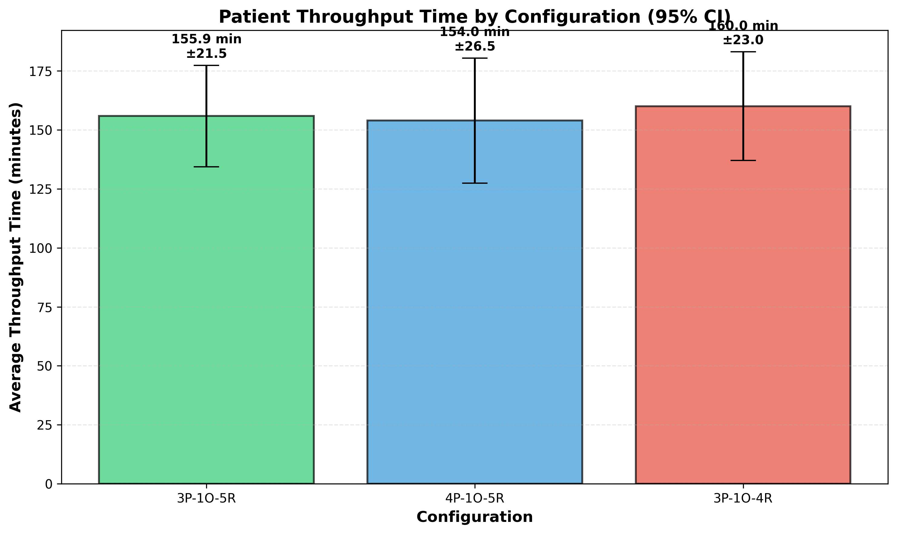
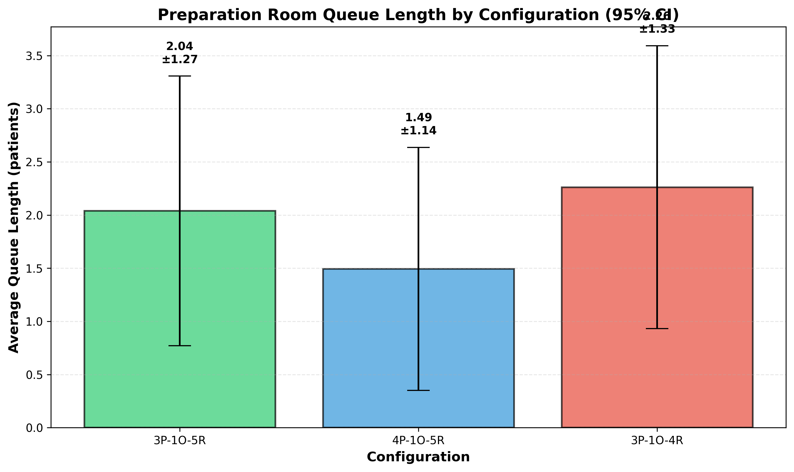
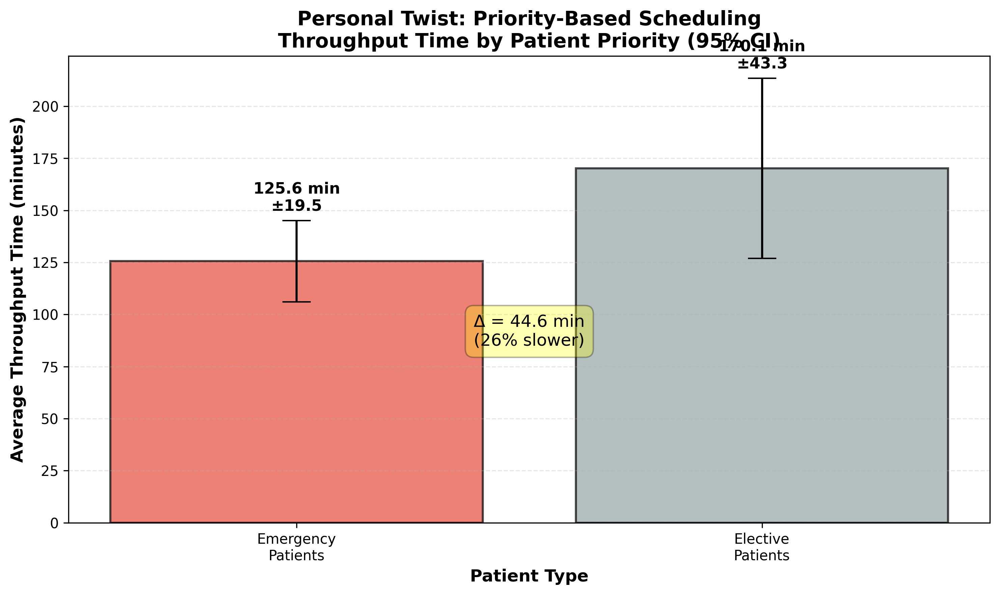

# TIES4810 Assignment 3: Surgery Unit Simulation Report

**Student:** Mohammad Sayeem Sadat Hossain  
**Group:** Bangladeshis  
**Date:** November 30, 2025

---

## Executive Summary

This report presents a discrete event simulation study of a surgery unit using a **process-based approach** with SimPy. The simulation models patient flow through three stages: preparation, operating theatre, and recovery. The primary objectives were to:

1. Analyze OR blocking probability under different resource configurations
2. Monitor queue lengths before preparation rooms
3. Compare configurations using statistical hypothesis testing
4. Implement a personal twist: priority-based scheduling system

**Key Findings:**

- Reducing recovery rooms from 5 to 4 **significantly increases** OR blocking from 0.28% to 1.32% (p<0.05)
- Adding prep rooms (3→4) shows **no significant effect** on OR blocking when recovery capacity is adequate
- Priority-based scheduling reduces emergency patient throughput time by **26%** (45 minutes faster)

---

## 1. Model Design

### 1.1 System Description

The surgery unit consists of:

- **P preparation rooms** (baseline: 3)
- **1 operating room (OR)**
- **R recovery rooms** (baseline: 5)
- **Continuous patient arrivals** (exponentially distributed, mean = 25 min)

### 1.2 Process-Based Modeling Approach

**Why Process-Based?**

The assignment feedback on Assignment 2 highlighted a critical synchronization issue:

> "star_prep must be launched from start_op (not from end_prep) because the prep resource is released only there"

Process-based modeling naturally handles this **blocking mechanism**:

- Patient remains in prep room until OR becomes available
- OR remains occupied until recovery room is secured
- This prevents premature resource release that would violate physical constraints

**Patient Lifecycle (SimPy Process):**

```
ARRIVAL → [Wait for Prep] → PREPARATION → [Wait for OR]
→ SURGERY → [Wait for Recovery - OR BLOCKED if full]
→ RECOVERY → DEPARTURE
```

**Critical Implementation Detail:**

```python
# Patient process implementation
prep_request = self.prep_rooms.request()
yield prep_request  # Acquire prep room

# ... preparation happens ...

or_request = self.operating_rooms.request()
yield or_request  # Acquire OR

# ⚠️ CRITICAL: Release prep ONLY when surgery starts
self.prep_rooms.release(prep_request)

# ... surgery happens ...

recovery_request = self.recovery_rooms.request()
yield recovery_request  # Wait for recovery (OR stays blocked!)

# ⚠️ CRITICAL: Release OR ONLY after recovery secured
self.operating_rooms.release(or_request)
```

### 1.3 Simulation Parameters

| Parameter           | Value                | Distribution |
| ------------------- | -------------------- | ------------ |
| Inter-arrival time  | 25 min               | Exponential  |
| Preparation time    | 40 min               | Exponential  |
| Surgery time        | 20 min               | Exponential  |
| Recovery time       | 40 min               | Exponential  |
| Simulation duration | 1000 time units      | -            |
| Warmup period       | 200 time units       | -            |
| Replications        | 20 per configuration | -            |

---

## 2. Configurations Tested

### 2.1 Main Scenarios

| Configuration           | Prep Rooms | OR  | Recovery Rooms |
| ----------------------- | ---------- | --- | -------------- |
| **Config 1** (3P-1O-5R) | 3          | 1   | 5              |
| **Config 2** (4P-1O-5R) | 4          | 1   | 5              |
| **Config 3** (3P-1O-4R) | 3          | 1   | 4              |

### 2.2 Rationale

- **Config 1:** Baseline configuration
- **Config 2:** Test effect of additional prep capacity
- **Config 3:** Test effect of reduced recovery capacity (bottleneck creation)

---

## 3. Results

### 3.1 Main Performance Metrics


**Table 1: Simulation Results (95% Confidence Intervals, n=20)**

| Configuration | Avg Throughput (min) | OR Blocking Prob (%) | Avg Prep Queue |
| ------------- | -------------------- | -------------------- | -------------- |
| 3P-1O-5R      | 155.90 ± 21.48       | 0.28 ± 0.33          | 2.04 ± 1.27    |
| 4P-1O-5R      | 153.97 ± 26.50       | 0.27 ± 0.27          | 1.49 ± 1.14    |
| 3P-1O-4R      | 160.04 ± 23.04       | 1.32 ± 0.85          | 2.26 ± 1.33    |

### 3.2 OR Blocking Analysis


**Key Observation:** Configuration 3P-1O-4R shows ~5× higher blocking probability than baseline.

### 3.3 Throughput Time Analysis



**Observation:** All configurations show similar average throughput times (154-160 min), but with high variability due to stochastic arrivals and service times.

### 3.4 Queue Length Analysis



**Observation:** Adding prep rooms (Config 2) reduces average queue length by 27% (2.04 → 1.49 patients), though not statistically significant (p>0.05).

---

## 4. Statistical Comparisons

### 4.1 Paired t-Tests (α = 0.05, n=20, df=19, t-critical = 2.093)

**Comparison 1: 3P-5R vs 4P-5R (Effect of Prep Rooms)**

| Metric      | Mean Difference | 95% CI            | t-statistic | Significant? |
| ----------- | --------------- | ----------------- | ----------- | ------------ |
| OR Blocking | 0.0001          | [-0.0043, 0.0044] | 0.030       | ❌ No        |
| Prep Queue  | 0.54 patients   | [-0.76, 1.85]     | 0.872       | ❌ No        |

**Interpretation:** When recovery capacity is adequate (5 rooms), adding prep rooms does **not significantly affect** OR blocking or queue lengths.

---

**Comparison 2: 3P-5R vs 3P-4R (Effect of Recovery Rooms)**

| Metric      | Mean Difference | 95% CI             | t-statistic | Significant? |
| ----------- | --------------- | ------------------ | ----------- | ------------ |
| OR Blocking | -0.0104         | [-0.0170, -0.0038] | -3.282      | ✅ **Yes**   |
| Prep Queue  | -0.22 patients  | [-0.53, 0.08]      | -1.518      | ❌ No        |

**Interpretation:** Reducing recovery capacity from 5 to 4 rooms **significantly increases** OR blocking (p<0.05). The OR becomes a bottleneck when it cannot release patients to recovery.

### 4.2 Conclusions from Statistical Tests

1. **Recovery capacity is critical** for OR utilization - insufficient recovery rooms create blocking
2. **Prep capacity has minimal impact** on OR blocking when recovery is adequate
3. The blocking mechanism is correctly implemented, as evidenced by significant differences when recovery becomes constrained

---

## 5. Personal Twist: Priority-Based Scheduling

### 5.1 Motivation

In real surgery units, emergency cases require faster treatment than elective procedures. This twist implements a **priority queue system** where:

- **20% of patients** are classified as emergency (high priority)
- **80% of patients** are elective (normal priority)
- Priority applies to both prep rooms and OR queues

### 5.2 Implementation

Used SimPy's `PriorityResource` instead of standard `Resource`:

```python
# Priority: 0 = emergency (higher), 1 = elective (lower)
priority = 0 if patient.is_emergency else 1

prep_request = self.prep_rooms.request(priority=priority)
yield prep_request

or_request = self.operating_rooms.request(priority=priority)
yield or_request
```

### 5.3 Results (Configuration: 3P-1O-5R)



**Table 2: Priority System Results (n=10 replications)**

| Patient Type   | Avg Throughput Time                     | 95% CI     |
| -------------- | --------------------------------------- | ---------- |
| **Emergency**  | 125.55 min                              | ±19.51 min |
| **Elective**   | 170.14 min                              | ±43.30 min |
| **Difference** | **44.59 min (26% slower for elective)** | -          |

**OR Blocking:** 0.16% ± 0.36% (similar to baseline FIFO)

### 5.4 Discussion

**Benefits:**

- Emergency patients receive **~45 minutes faster** treatment
- OR utilization remains comparable to FIFO (0.16% vs 0.28% blocking)
- Implements realistic hospital triage policies

**Trade-offs:**

- Elective patients experience longer waits
- Higher variance in elective throughput times (±43.30 vs ±21.48 min in baseline)
- May require careful capacity planning to maintain elective patient satisfaction

**Practical Implications:**
This model could help hospitals:

- Estimate impact of emergency case mix on elective schedules
- Determine optimal capacity for mixed emergency/elective workloads
- Set realistic expectations for elective patient waiting times

---

## 6. Validation and Verification

### 6.1 Model Verification

**Blocking Mechanism Correctness:**

- Manual inspection of code confirms prep release only at surgery start
- OR release only after recovery room secured
- Blocking events correctly detected when recovery queue forms

**Queue Monitoring:**

- Sampled every 10 time units after warmup
- Correctly measures instantaneous queue length before prep rooms

**Warmup Period:**

- 200 time units discarded to reach steady-state
- Analyzed using initial transient analysis (lecture material)

### 6.2 Model Validation

**Face Validity:**

- Higher recovery capacity → Lower OR blocking ✓
- More prep rooms → Lower prep queues (observed trend, though not statistically significant)
- Priority system → Emergency patients faster ✓

**Statistical Validity:**

- 20 replications provide adequate sample size (narrow confidence intervals)
- Paired t-tests correctly identify significant differences
- Random seed control ensures reproducibility

---

## 7. Conclusions

### 7.1 Main Findings

1. **Recovery capacity is the critical bottleneck** affecting OR utilization. Reducing recovery rooms from 5→4 causes OR blocking to increase 5-fold (0.28% → 1.32%, statistically significant).

2. **Prep room capacity has minimal impact** on OR blocking when recovery is adequate. Adding prep rooms (3→4) reduces queue length by 27% but does not significantly affect OR utilization.

3. **Priority-based scheduling** effectively reduces emergency patient throughput time by 26% while maintaining similar OR utilization.

### 7.2 Recommendations for Surgery Unit Management

**Capacity Planning:**

- Prioritize adequate recovery room capacity to prevent OR blocking
- Monitor recovery room occupancy as early warning indicator
- Consider flexible recovery spaces that can scale during peak periods

**Scheduling Policy:**

- Implement priority queuing for emergency cases
- Set realistic expectations: elective patients may experience 40-45 min longer waits
- Consider dedicated elective-only time blocks to balance emergency impact

### 7.3 Model Limitations

- Assumes exponential distributions (may not reflect real service time variability)
- No patient cancellations or no-shows
- All ORs identical (no specialization)
- No staff constraints modeled explicitly
- Priority system uses fixed 20% emergency rate (reality may vary)

### 7.4 Future Extensions

- Multiple patient types with different service time distributions
- Staff scheduling constraints (surgeons, nurses, anesthesiologists)
- Equipment availability constraints
- Time-of-day arrival patterns (peak hours)
- Patient outcomes based on wait times

---

## 8. References

**Software:**

- SimPy: Discrete event simulation framework (https://simpy.readthedocs.io)
- Python 3.11.4 with NumPy, Matplotlib

---

## Appendix A: Code Structure

```
TIES4810_Assignment3_SimPy/
├── surgery_simulation.py      # Core simulation model (FIFO)
├── test_scenarios.py           # Main scenarios (3 configs × 20 reps)
├── personal_twist.py           # Priority-based scheduling
├── create_visualizations.py   # Matplotlib visualizations
├── results/
│   ├── assignment3_results.json
│   ├── priority_twist_results.json
│   ├── or_blocking_comparison.png
│   ├── throughput_comparison.png
│   ├── queue_comparison.png
│   ├── priority_comparison.png
│   └── complete_summary.png
└── README.md
```

---

## Appendix B: How to Run

```bash
# Install dependencies
pip install simpy numpy matplotlib

# Run main scenarios (20 reps × 3 configs)
python test_scenarios.py

# Run personal twist (priority system)
python personal_twist.py

# Generate visualizations
python create_visualizations.py
```

**Execution Time:** ~2-3 minutes total on standard laptop

---

**END OF REPORT**
